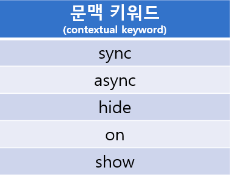

# 다트의 키워드

## 식별자
변수, 함수 등의 이름

## 내장 식별자(built-in identifier) 
built-inIdentifier.dart

내장 식별자는 클래스명, 타입명, import의 prefix로 사용할 수 없다.

##

## 키워드

특정 문맥에서 특별한 의미를 가지는 단어.

'특정 문맥' 이 아닌 곳에서는 식별자로 사용 가능하다.

문맥 키워드 5종

keyword.dart 에 show 키워드를 사용하는 예가 있다.
##